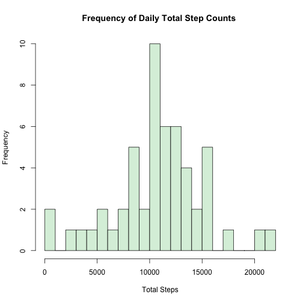
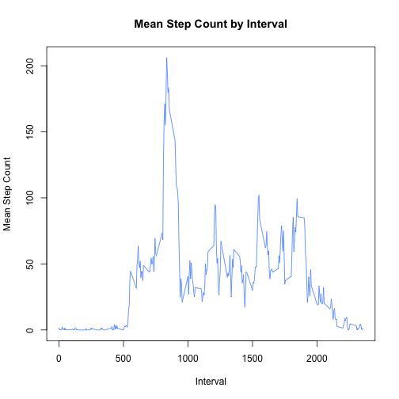
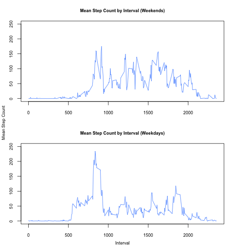

# Reproducible Research: Peer Assessment 1
The purpose of this assignment was to analyze the activity data for an individual over two months. The data can be downloaded from the following URL:
    [Activity Monitoring Data](https://d396qusza40orc.cloudfront.net/repdata%2Fdata%2Factivity.zip)
    
The data consists of three columns:

1. The number of steps taken in a 5-minute interval (missing values are coded as NA).
2. The date on which the measurement was taken (YYYY-MM-DD)
3. The identifier for the 5-minute interval in which the measurement was taken.

All of the code and generated plots for this analysis can be found at the following url:
    [Github - RepData_PeerAssessment1](https://github.com/rmb177/RepData_PeerAssessment1)
    
The code is contained in a single source file named *activity_analysis.R*. The generated plots can be found in the *figure* directory. The source code and generated plots are described below.


## Environment
The code/output was generated in the following environment:

```r
sessionInfo()
```

```
## R version 3.0.3 (2014-03-06)
## Platform: x86_64-apple-darwin10.8.0 (64-bit)
## 
## locale:
## [1] en_US.UTF-8/en_US.UTF-8/en_US.UTF-8/C/en_US.UTF-8/en_US.UTF-8
## 
## attached base packages:
## [1] stats     graphics  grDevices utils     datasets  methods   base     
## 
## other attached packages:
## [1] knitr_1.6       lubridate_1.3.3
## 
## loaded via a namespace (and not attached):
##  [1] digest_0.6.4     evaluate_0.5.5   formatR_0.10     htmltools_0.2.4 
##  [5] memoise_0.2.1    plyr_1.8.1       Rcpp_0.11.1      rmarkdown_0.2.46
##  [9] stringr_0.6.2    tools_3.0.3
```


## Loading and preprocessing the data
The zip file containing the activity data was provided with the assignment. My code
assumes the zip file is present in the working directory.

I first create a generator function to process the date format used by the file.


```r
library("lubridate")
setClass('myDate')
setAs("character", "myDate", function(from) as.Date(from, format="%Y-%m-%d"))
```

I then unzip the file and read in the data.

```r
unzip("activity.zip")
activityData <- read.csv("activity.csv", 
                         header=TRUE, 
                         colClasses=c("numeric", "myDate", "numeric"), 
                         comment.char="")
```

Finally, I transform the data into formats needed throughout the analysis.

```r
# Sum up the total number of steps for each individual day
stepsByDay <- aggregate(activityData$steps, by=activityData[c("date")], FUN=sum, na.rm=TRUE)

# Average the total number of steps for each time interval
stepsByInterval <- aggregate(activityData$steps, by=activityData[c("interval")], FUN=mean, na.rm=TRUE)
```


## What is mean total number of steps taken per day?
The first part of the assignment asks for the following items:

1. Make a histogram of the total number of steps taken each day.
2. Calculate and report the mean and median total number of steps taken per day.

The instructions stated to ignore N/A values, which resulted in days with 0 total steps. These days were removed with the following code.


```r
stepsByDayValidObservations <- stepsByDay[stepsByDay[,2] > 0, ]
```

The histogram was generated with the following code. I specified that the histogram show 20 groups to give a more fine-grained view of the step counts:

```r
hist(stepsByDayValidObservations[, 2], 
     breaks=20,
     main="Frequency of Daily Total Step Counts ",
     xlab="Total Steps",
     col="#daf0dd")
```

 

The mean and median were generated with the following code:

```r
print(paste("Mean number of steps taken per day = ", round(mean(stepsByDayValidObservations[, 2]), 2)))
```

```
## [1] "Mean number of steps taken per day =  10766.19"
```

```r
print(paste("Median number of steps taken per day = ", round(median(stepsByDayValidObservations[, 2], 2))))
```

```
## [1] "Median number of steps taken per day =  10765"
```


## What is the average daily activity pattern?
The next part of the assignment asks for the following items:

1. Make a time series plot (i.e. type = "l") of the 5-minute interval (x-axis) and the average number of steps taken, averaged across all days (y-axis)
2. Which 5-minute interval, on average across all the days in the dataset, contains the maximum number of steps?

Both pieces of information were generated with the following code:

```r
plot(stepsByInterval[, 1], 
     stepsByInterval[, 2], 
     type="l",
     main="Mean Step Count by Interval",
     xlab="Interval",
     ylab="Mean Step Count",
     col="#498dff")
```

 

```r
maxIndex = which.max(stepsByInterval[, 2])
print(paste("The interval with the maximum average number of steps taken is interval",
            stepsByInterval[maxIndex, 1],
            "with the average number of steps =",
            round(stepsByInterval[maxIndex, 2], 2)))
```

```
## [1] "The interval with the maximum average number of steps taken is interval 835 with the average number of steps = 206.17"
```


## Imputing missing values
The next part of the assignment asked for the following items:

1. Calculate and report the total number of missing values in the dataset (i.e. the total number of rows with NAs)
2. Devise a strategy for filling in all of the missing values in the dataset. The strategy does not need to be sophisticated. For example, you could use the mean/median for that day, or the mean for that 5-minute interval, etc.
3. Create a new dataset that is equal to the original dataset but with the missing data filled in.
4. Make a histogram of the total number of steps taken each day and Calculate and report the mean and median total number of steps taken per day. Do these values differ from the estimates from the first part of the assignment? What is the impact of imputing missing data on the estimates of the total daily number of steps?

The total number of missing values in the dataset was generated by the following code:

```r
print(paste("The total number of NA values in the original data set =", sum(!is.na(activityData[, 1]))))
```

```
## [1] "The total number of NA values in the original data set = 15264"
```

For part two, I decided to use the suggested strategy of replacing NA values with the averages steps for the corresponding interval. To do this, I first created the following function:


```r
lookupAverageStepsForInterval <- function(rowData, lookupTable)
{
    if (is.na(rowData[1]))
    {
        return(lookupTable[lookupTable$interval == as.numeric(rowData[3]), 2])
    }
    else
    {
        return(as.numeric(rowData[1]))
    }
}
```
The function takes in a row of the original dataset and a data matrix of the average steps per interval that serves as a lookup table. If the step value is NA, the function returns the corresponding average for the row's interval value. Otherwise, it returns the original step value.

This function is then used to generate the new dataset and calculate the new total steps per day values:

```r
imputedData <- data.frame(apply(activityData, 1, lookupAverageStepsForInterval, stepsByInterval), 
                          activityData[, 2], 
                          activityData[, 3])
colnames(imputedData) <- colnames(activityData)

imputedStepsByDay <- aggregate(imputedData$steps, by=imputedData[c("date")], FUN=sum, na.rm=TRUE)
```

The histogram was then generated with the following code:

```r
hist(imputedStepsByDay[, 2], 
     breaks=20,
     main="Frequency of Daily Total Step Counts ",
     xlab="Total Steps",
     col="#daf0dd")
```

 

The mean and median were then generated with the following code:

```r
print(paste("Mean number of steps taken per day = ", round(mean(imputedStepsByDay[, 2]), 2)))
```

```
## [1] "Mean number of steps taken per day =  10766.19"
```

```r
print(paste("Median number of steps taken per day = ", round(median(imputedStepsByDay[, 2]), 2)))
```

```
## [1] "Median number of steps taken per day =  10766.19"
```

As you can see, the impact of imputing the missing values was minimal. There was no difference in the mean and the median shifted higher by 1.19 steps. This makes sense since I replaced missing values with average values.

## Are there differences in activity patterns between weekdays and weekends?
The last part of the assignment asked for the following items:
1. Create a new factor variable in the dataset with two levels – “weekday” and “weekend” indicating whether a given date is a weekday or weekend day.
2. Make a panel plot containing a time series plot (i.e. type = "l") of the 5-minute interval (x-axis) and the average number of steps taken, averaged across all weekday days or weekend days (y-axis).

The following code creates the factor variable specified in part 1 and breaks up the data into appropriate groups representing the two factors:


```r
weekend = c("Saturday", "Sunday")
activityData[, "time.of.week"] <- 
 sapply(activityData[, 2], function(x) if (is.element(weekdays(x), weekend)) as.factor('weekend') else as.factor('weekday'))
weekdaysData <- activityData[activityData$time.of.week == "weekday", ]
weekendsData <- activityData[activityData$time.of.week == "weekend", ]
```

The following code then plots the two groups of data:

```r
par(mfrow = c(2, 1))
par(mar = c(3, 3, 3, 3))
        
stepsByIntervalWeekends <- aggregate(weekendsData$steps, by=weekendsData[c("interval")], FUN=mean, na.rm=TRUE)
plot(stepsByIntervalWeekends[, 1], 
     stepsByIntervalWeekends[, 2], 
     type="l",
     main="Mean Step Count by Interval (Weekends)",
     xlab="",
     ylab="",
     col="#498dff",
     cex.main=0.75,
     cex.axis=0.75,
     ylim=c(0, 250))

stepsByIntervalWeekdays <- aggregate(weekdaysData$steps, by=weekdaysData[c("interval")], FUN=mean, na.rm=TRUE)
plot(stepsByIntervalWeekdays[, 1], 
     stepsByIntervalWeekdays[, 2],
     type="l",
     main="Mean Step Count by Interval (Weekdays)",
     xlab="",
     ylab="",
     col="#498dff",
     cex.main=0.75,
     cex.axis=0.75,
     ylim=c(0, 250))

mtext("Interval", side=1, padj=-2, outer=TRUE, cex=0.75)
mtext("Mean Step Count", side=2, padj=2, outer=TRUE, cex=0.75)
```

 

Looking at the graphs, there are some interesting things to observe:

1. During the weekdays, the subject has more activity earlier in the morning. This could be due to the subject having to wake up earlier during the week to prepare for their work day.
2. During the weekdays, the subject has a small spike in steps around the interval of 900. This could be due to steps taken when arriving at work and getting situated (though there is no corresponding spike at the end of the day).
3. During the majority of the day, the subject seems to be a little more active on the weekends than the weekdays. This could be due to them having a desk job.

All of the conclusions above are speculative since we have no actual contextual information about the subject. The conclusions also assume the interval data labels are ordered by time from midnight-midnight.
